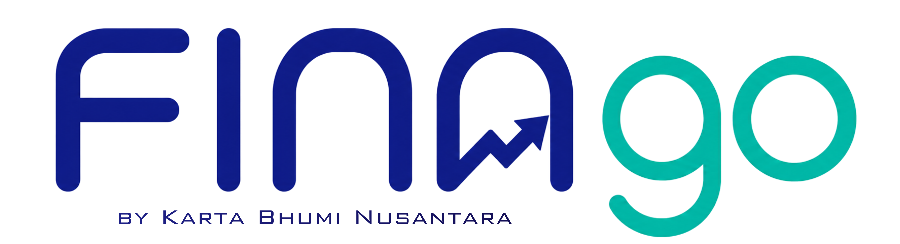

# FINA go

> Platform pengajuan internal **PT. Karta Bhumi Nusantara** — reimburse + purchase request dengan approval workflow.

<p align="center"></p>

## Status

🚧 **Phase 2 — Fitur lengkap.** **FE asli (`app/`)** + **backend (`backend/`)** nyambung end-to-end. Stack: vanilla+Alpine+Tailwind FE (mobile-friendly), Hono+Drizzle+libSQL BE.

Jalan: **auth sendiri (JWT email+password)** → main menu → buat pengajuan (+ preview FORMULIR popup) → submit (anomaly check) → approval (verify/approve/reject by-amount rule) → **download .docx nyata** (lib `docx`). Plus kelola rekening, monitored-items (anti pengajuan ganda), master proyek. Storage R2 = FS-backed (dev). OneDrive/Graph = real-code, aktif kalau env Azure di-set. Demo mockup awal masih di `demo/`.

## Apa yang FINA go selesaikan

Karyawan PT. Karta Bhumi Nusantara butuh 2 jenis pengajuan:

1. **Reimbursement** — klaim biaya yang sudah dikeluarkan (BBM, perdiem, perbaikan alat, makan dinas, dll)
2. **Purchase Request** — minta perusahaan beli sesuatu (alat baru, supplies, software license, dll)

Sekarang prosesnya manual (file docx + xlsx, email, chat WA, approval verbal). FINA go = workflow digital dengan:
- Form submission standar
- Approval chain (manager → finance → director, configurable per nominal)
- Attachment (receipt, quotation, kwitansi)
- Audit trail per pengajuan
- Dashboard finance: pending, total budget, breakdown
- Status tracking real-time

## Brand

| Element | Value |
|---|---|
| Nama | **FINA go** |
| Tagline | *by Karta Bhumi Nusantara* |
| Primary | Navy `#1e2a8e` |
| Accent | Teal `#14b8a6` |
| Logo | [`brand/finago-logo.png`](./brand/finago-logo.png) |
| Vibe | Money, growth, trust |

## Stack target

**Vanilla JS + Alpine.js + Tailwind CSS** — no build step. Drag-drop ke Netlify.

| Alasan | Detail |
|---|---|
| Domain simple | Form + approval + table, tidak ada offline-first drama / drag chart / peta |
| AI-friendly | Single-file SPA pattern terbukti efektif di HydroCanal demo (~3000 baris, lancar) |
| Easy deploy | Drag folder ke Netlify, atau host static di mana saja |
| No churn | Tidak ada dependency hell, security update minimal |
| Cepet onboarding | Tim baru bisa baca code langsung tanpa belajar tooling |

Backend: **Express + MongoDB** (pattern sama dengan HydroCanal backend).

## Sister app

[`../new-hydro-canal/`](../new-hydro-canal/) — QC kanal app. Punya pattern yang bisa di-reuse di FINA go:

- `demo/style.css` — dark mode pattern, role pill, walkthrough tour, command palette CSS
- `demo/app.js` — router, state management, render functions structure
- `demo/index.html` — template per route pattern

Saat scaffold demo FINA go, fork pattern ini langsung — jangan reinvent. Cuma swap warna (sky `#0284c7` → navy `#1e2a8e` + teal accent).

## Docs (akan ditulis berurutan)

1. **`README.md`** ← file ini (overview)
2. `CLAUDE.md` — instruksi untuk Claude di sesi baru
3. `FEEDBACK.md` — sumber requirement (file docx reimburse, xlsx purchase log, interview user)
4. `DOMAIN.md` — data model (pengajuan, approval chain, attachment, budget category)
5. `PLAN.md` — roadmap fase + tech decisions
6. `PLAN-FE.md` — frontend detail per page
7. `PLAN-BE.md` — backend detail per endpoint
8. `demo/` — HTML mockup (akan dibuat setelah requirement jelas)

## Quick start (kelak)

```bash
cd demo
python3 -m http.server 8080
# → http://localhost:8080
```

## Related

- **Parent company**: PT. Karta Bhumi Nusantara (juga vendor utama di HydroCanal QC)
- **Sister app**: [`../new-hydro-canal/`](../new-hydro-canal/)
- **Umbrella**: [`../README.md`](../README.md) — bhumi-karta workspace
